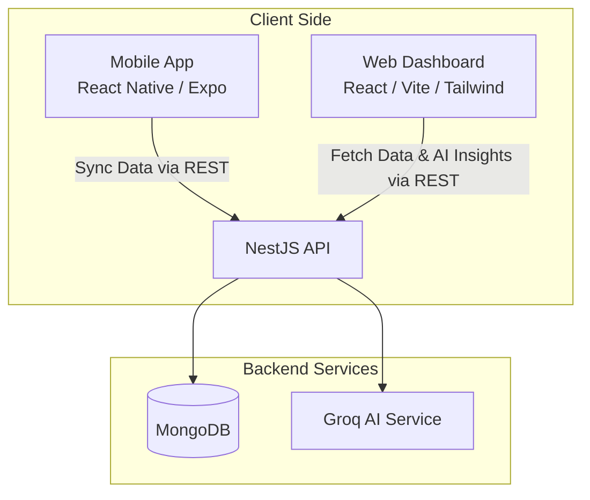

<div align="center">
  <h1>🌟 NAWAT FOCUS</h1>
  <p><strong>An offline-first AI-powered serious game platform for children with ADHD in low-resource environments.</strong></p>

  <p>
    <a href="#📱-mobile-app-child-facing"></a>
    <a href="#💻-web-dashboard-parentteacher-facing"></a>
    <a href="#⚙️-backend-api"></a>
    <a href="#🧠-ai-integration"></a>
  </p>
</div>

<hr/>

## 📖 Table of Contents

- [About the Project](#-about-the-project)
- [Key Features](#-key-features)
- [Architecture & Tech Stack](#-architecture--tech-stack)
- [Game Villages (Data Architecture)](#-game-villages-data-architecture)
- [Project Structure](#-project-structure)
- [Getting Started (Local Development)](#-getting-started-local-development)
  - [Prerequisites](#prerequisites)
  - [Environment Variables](#environment-variables)
  - [Backend Setup](#1-backend-setup)
  - [Web Dashboard Setup](#2-web-dashboard-setup)
  - [Mobile App Setup](#3-mobile-app-setup)
- [Sync Engine Architecture](#-sync-engine-architecture)
- [Privacy & Security](#-privacy--security)
- [Contributing](#-contributing)
- [License](#-license)

---

## 🎯 About the Project

**NAWAT FOCUS** is a comprehensive, scientifically-inspired mobile application and management dashboard designed to help children with ADHD improve core cognitive and emotional skills. Through a series of interactive "Villages" (mini-games), the platform targets:

- **Attention & Focus**
- **Impulse Control (Response Inhibition)**
- **Emotional Regulation & Calmness**
- **Task Organization & Sequencing**
- **Sustained Motivation**

> ⚠️ **Important Disclaimer:** This solution is for educational, supportive, and skill-building purposes only. It does **NOT** diagnose ADHD or replace professional medical advice.

---

## ✨ Key Features

### 📱 Mobile App (Child Facing)
- **Offline-First Play:** Games and data tracking work seamlessly without an internet connection.
- **Engaging Mini-Games:** Four distinct "Villages" targeting different cognitive skills.
- **Local SQLite & MMKV:** Lightning-fast local storage for game state and metrics.
- **Smart Sync:** Automatically syncs game data to the cloud when an internet connection is detected.
- **Non-Intrusive Monitoring:** Tracks reaction times, accuracy, and impulsivity quietly in the background.

### 💻 Web Dashboard (Parent/Teacher Facing)
- **Glassmorphism Design:** A modern, beautiful, and responsive UI with dynamic gradients and translucent cards.
- **Advanced Analytics:** Real-time charts and graphs (via Recharts) displaying progress over time.
- **AI-Powered Insights:** Integrated AI Chatbot powered by **Groq AI** analyzes game data to provide personalized recommendations for parents and educators.
- **Detailed Profiles:** In-depth views of each child's performance, emotional check-ins, and strengths.

### ⚙️ Backend (API)
- **Robust Architecture:** Built with NestJS for scalability and maintainability.
- **Single Document Schema:** Optimized MongoDB schema for fast reads and writes of game data.
- **Secure Authentication:** JWT-based role authentication.
- **AI Orchestration:** Acts as the middleman between the web dashboard and the **Groq AI** service for generating fast, privacy-first insights.

---

## 🏗 Architecture & Tech Stack



### Detailed Stack

| Domain | Technologies |
| :--- | :--- |
| **Mobile Frontend** | React Native, Expo, TypeScript, Expo Router, Zustand, React Query, React Native SVG, Expo Camera, Expo SQLite, Reanimated, MMKV |
| **Web Frontend** | React, Vite, TypeScript, Tailwind CSS, Recharts, React Router DOM |
| **Backend API** | NestJS, TypeScript, MongoDB, Mongoose, Passport (JWT), Swagger |
| **AI / Machine Learning** | Groq AI (LLaMA), privacy-first inference for fast, on-demand insights |

---

## 🎮 Game Villages (Data Architecture)

The backend employs a **Single Document Schema** per child to store game metrics efficiently. Data is saved in four distinct arrays inside a `GameData` document. During synchronization, the mobile app dynamically calculates a `score` and `remarks` based on accuracy and pushes it directly into the relevant array.

### 1️⃣ Village 1: Noise Souk (Attention Training)
- **Goal:** Tap only target objects, ignore distractors (Continuous Performance Task).
- **Stored Metrics:** Correct hits, omissions, commissions, reaction time, score, remarks.

### 2️⃣ Village 2: Gate of Patience (Impulse Control)
- **Goal:** Green = tap, Red = don't tap, Yellow = wait before tapping (Go/No-Go Paradigm).
- **Stored Metrics:** Impulsive responses, correct inhibition, reaction time, score, remarks.

### 3️⃣ Village 3: Cloud Valley (Calmness & Emotional Regulation)
- **Goal:** Camera-based tracing activity with transparent overlay to promote slow, deliberate movements.
- **Stored Metrics:** Accuracy, smoothness, completion time, calm score, remarks.

### 4️⃣ Village 4: Backpack Oasis (Organization)
- **Goal:** Drag and drop daily tasks into the correct logical sequence.
- **Stored Metrics:** Correct sequence, completion time, score, remarks.

---

## 📁 Project Structure

```text
nawat-app/
├── mobile-app/              # React Native Expo app (Child facing)
│   ├── src/
│   │   ├── app/             # Expo Router screens (Game Villages, Home)
│   │   ├── components/      # Reusable UI components
│   │   ├── store/           # Zustand state management
│   │   ├── services/        # Sync, SQLite, and API services
│   │   └── assets/          # Images, fonts, sounds
│   ├── app.json             # Expo configuration
│   └── package.json
├── web-dashboard/           # React Vite app (Parent/Teacher facing)
│   ├── src/
│   │   ├── pages/           # Analytics, Dashboard, ChildProfile, Chatbot
│   │   ├── contexts/        # DataContext, AuthContext
│   │   ├── components/      # Reusable UI components (Glassmorphism)
│   │   ├── utils/           # Helper functions
│   │   └── index.css        # Tailwind utility classes
│   ├── tailwind.config.js
│   └── package.json
├── backend/                 # NestJS API
│   ├── src/
│   │   ├── auth/            # JWT Authentication modules
│   │   ├── users/           # User management
│   │   ├── mongodb/         # Mongoose schemas & services
│   │   │   ├── schemas/     # Single Document GameData Schema
│   │   │   └── services/    # Data sync logic
│   │   ├── ai/              # Groq AI integration module
│   │   └── main.ts          # Application entry point
│   └── package.json
├── shared/                  # (Optional) Shared types and interfaces
└── README.md
```

---

## 🚀 Getting Started (Local Development)

Follow these instructions to set up the project locally for development and testing.

### Prerequisites
Ensure you have the following installed on your machine:
- **Node.js** (v18.x or higher)
- **npm** or **yarn**
- **MongoDB** (Local instance or MongoDB Atlas URL)
- **Expo CLI** (`npm install -g expo-cli`)
- **Android Studio** or **Xcode** (For mobile emulator/simulator testing)
- **Groq API Key** (Get yours free at [console.groq.com](https://console.groq.com))

### Environment Variables

You will need to create `.env` files in both the `backend` and `web-dashboard` directories.

**`backend/.env`**
```env
PORT=3001
MONGODB_URI=mongodb://localhost:27017/nawat-focus
JWT_SECRET=your_super_secret_jwt_key
GROQ_API_KEY=your_groq_api_key_here
```

**`web-dashboard/.env`**
```env
VITE_API_URL=http://localhost:3001/api
```

---

### 1. Backend Setup

```bash
# Navigate to the backend directory
cd backend

# Install dependencies
npm install

# Copy environment variables
cp .env.example .env 
# (Make sure to configure MongoDB URI and GROQ_API_KEY in the .env file)

# Start the NestJS development server
npm run start:dev
```
> 📚 **API Documentation:** Once the backend is running, Swagger documentation is available at `http://localhost:3001/api/docs`.

---

### 2. Web Dashboard Setup

```bash
# Navigate to the web-dashboard directory
cd web-dashboard

# Install dependencies
npm install

# Copy environment variables
cp .env.example .env 
# (Make sure VITE_API_URL is pointing to your backend)

# Start the Vite development server
npm run dev
```
> 🌐 **Dashboard Access:** The dashboard will be available at `http://localhost:3000`.

---

### 3. Mobile App Setup

```bash
# Navigate to the mobile-app directory
cd mobile-app

# Install dependencies
npm install

# Start the Expo development server
npm start
```
> 📱 **Running the App:** After running `npm start`, press `a` to open in an Android emulator, `i` to open in an iOS simulator, or scan the QR code with the Expo Go app on your physical device.

---

## 🔄 Sync Engine Architecture

To accommodate low-resource environments with spotty internet connectivity, NAWAT FOCUS relies on a robust offline-first sync engine.

1. **Local Play:** The child plays games; all metrics (reaction times, hits, misses) are stored locally in SQLite/MMKV.
2. **Evaluation:** When a session ends, the mobile app evaluates the raw metrics and calculates an aggregated `score` (0-100) and contextual `remarks`.
3. **Detection:** The app continuously monitors network state.
4. **Synchronization:** When internet becomes available, the app uploads the finalized objects to the backend via REST.
5. **Storage:** The NestJS backend pushes the data directly into the relevant designated game array within the child's `GameData` single document.

---

## 🧠 AI Integration

NAWAT FOCUS uses **[Groq AI](https://groq.com)** as its inference engine to power the AI Chatbot in the web dashboard. Groq's ultra-fast LPU (Language Processing Unit) inference ensures near-instant responses, making it ideal for real-time parent and teacher consultations.

- **Model:** LLaMA (via Groq API)
- **Use Case:** Analyzing aggregated game metrics and generating personalized, actionable recommendations.
- **Privacy:** No raw gameplay data or personal identifiers are ever sent to Groq. Only anonymized, aggregated scores and remarks are included in prompts.

---

## 🔐 Privacy & Security

Protecting the data of children is the highest priority for NAWAT FOCUS. The platform adheres to strict privacy-by-design principles:

- 🚫 **No Real Names:** Avatars and pseudonyms are used exclusively.
- 🚫 **No Camera Images Stored:** Any camera-based activities (like Village 3) process frames in memory and immediately discard them. No images or videos are saved or transmitted.
- 🚫 **No Audio Recording:** Microphone access is not required or used.
- 🚫 **No Diagnostics:** The app explicitly does not offer ADHD diagnoses.
- 🚫 **No Public Rankings:** Leaderboards or comparisons between children are not permitted to prevent anxiety.
- ✅ **Local-First Storage:** All raw data is stored locally on the device.
- ✅ **Secure Sync:** Data is synced via secure API endpoints only when internet is available.
- ✅ **Anonymized AI Prompts:** Only aggregated, anonymized scores are sent to Groq AI — never raw data or identifiers.

---

## 🤝 Contributing

This project is currently a production-ready MVP built for educational purposes. We welcome contributions from developers, educators, and designers! 

**Areas for Contribution:**
- 🌍 **Localization:** Adding support for more languages (Arabic, French, Spanish, etc.).
- ♿ **Accessibility:** Improving contrast, screen reader support, and tactile feedback.
- 🎮 **Game Mechanics:** Enhancing existing villages or adding new ones.
- 🤖 **AI Prompts:** Refining the Groq AI backend prompts to produce better, more actionable recommendations.

### Steps to Contribute:
1. Fork the repository.
2. Create a new branch (`git checkout -b feature/AmazingFeature`).
3. Commit your changes (`git commit -m 'Add some AmazingFeature'`).
4. Push to the branch (`git push origin feature/AmazingFeature`).
5. Open a Pull Request.

---

## 📄 License

This project is developed for educational purposes. 

> **Disclaimer:** Please ensure compliance with local regulations (such as COPPA, GDPR-K, HIPAA) if you plan to deploy this platform in a real-world clinical or educational setting.

<div align="center">
  <i>Built with ❤️ for inclusive education.</i>
</div>
